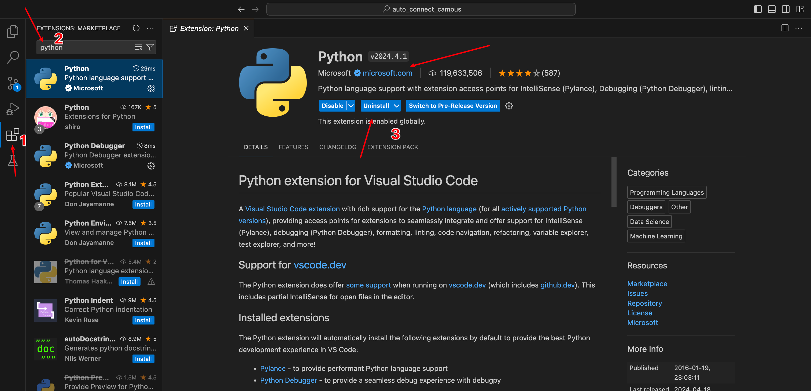
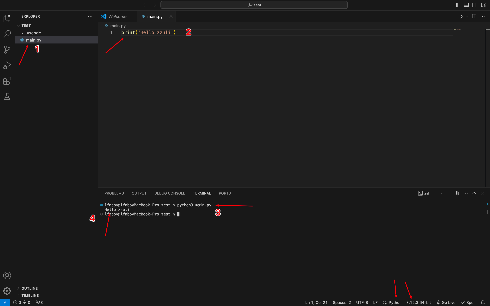
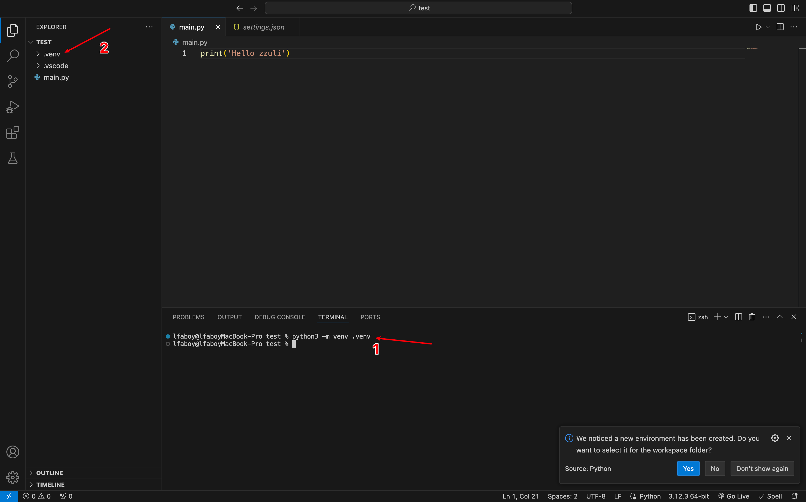
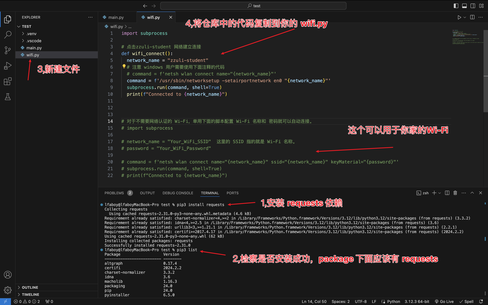
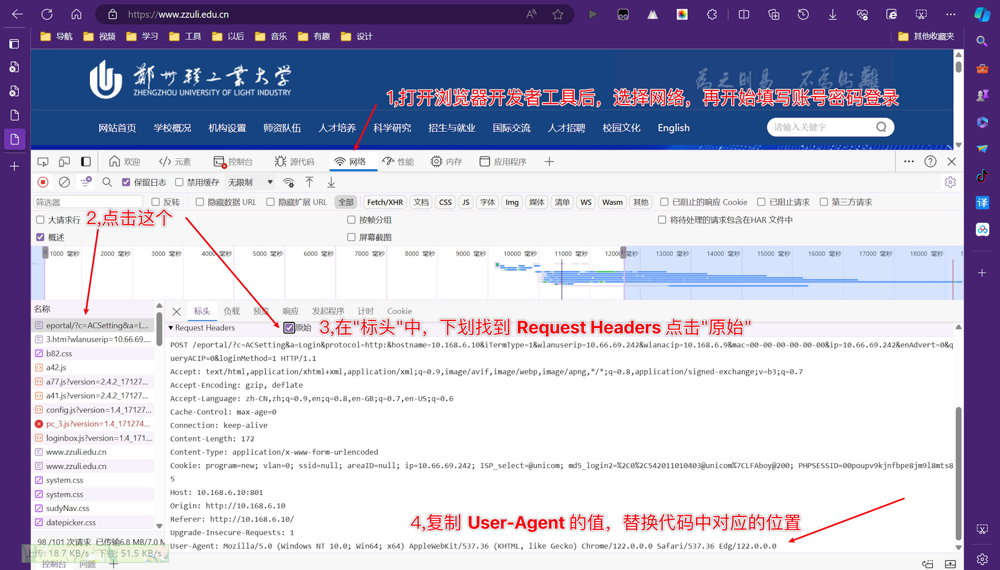
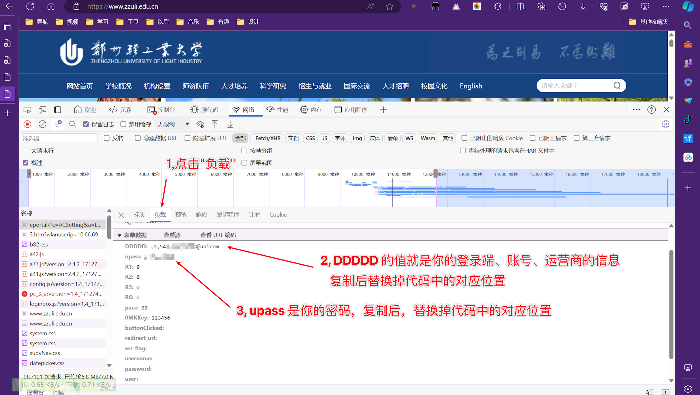
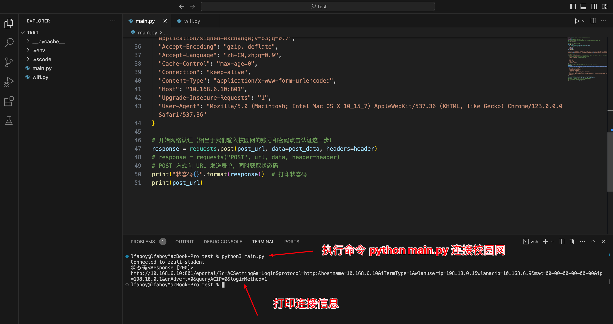

# ZZULI CAN(Campus Area Network) Login Automatically
<p style='color: orange'>自动登录郑州轻工业大学校园网脚本</p>


## 🌃 Background

Mac OS 系统由于 CNA(Captive Network Assistant).app 的存在，导致每次CAN验证都是使用这个app打开，且在这个app中用不了密码填充，只能老老实实输一遍账号密码，选择运营商，这就很难受了。2024.4.10号早上开电脑的时候又弹窗了验证，一瞬间有点崩溃，就开始搞这个脚本。到11号解决了脚本登录问题，12号解决了 CNA.app的弹窗，期间参考了好多文档（参考<a href="#more">Links</a>），终于写出了一个适配的脚本了。现在分享出来，希望也能稍微方便一点校友吧。macOS 是方便了不少；win由于本身可在浏览器中用密码填充，不使用持久化的情况下体验提升不太多。

## 🖊️ Intro
* ❤ 这个教程是一个自动登录zzuli CAN 的脚本，节省了密码认证环节；
* 🛜 wifi.py 文件的功能就是替我们点击 "zzuli-student" 网络；
* ⚙️ main.py 文件的功能就是替我们输入账号密码和选择运营商，然后点击登录，帮我们进行验证；
* ☕️ 对于其他需要认证的公共网络，都可以在本脚本的基础上稍微修改后使用（公司内网，或者星巴克Wi-Fi，星巴克咱没去过）；
* 🌍 本脚本暂时未在 iOS 和 Android 上试过，后期有时间、有机会的话会更新，也欢迎 软件和计院 大佬提提意见，咱是物理院小透明；
* 🛡️ 连接校园网时请<span style="color:red">关闭代理</span>，连接成功后再打开；
* 👉 实现自动化脚本登录校园网的方式很多，本脚本只是其中一种方案，其他方案请参考 <a href="#more">Links</a> 或者网络；
* ⏰ 你可能需要花费半小时或更长，完成属于自己的脚本，时间可能有点长，不过还是非常值得的🌹。

##  🔨 Usage

###  Mac & Win

1. 了解 Mac CNA.app 弹窗验证问题

   ```
   1. 连接公共网络后，CNA.app 会自动检测网络是否通畅，如果不通会自动弹出一个页面，让用户去登录。
   2. CNA.app 是通过 发送一个http/1.0的请求到 http://www.apple.com/library/test/success.html，根据回应判断是否通畅。
   3. 如果回应跟它预计到结果一致，那么认为网络是通畅的，就不会自动弹出认证页面，流程结束。否则会弹出认证页面。
   4. 如果回应中的html文件中的title 标签内容是 Success （大小写敏感）那么就认为是通畅的，否则就不通畅。
   ```

2. 解决 CNA.app 弹窗的原理 & 方案

   本脚本采用的是改变 CNA.app 检测网络是否通畅的 http 请求 的 URL ，指向一个返回的 HTML 中 title 标签内容包含 Success 字符串(区分大小写)的地址即可。其他解决CNA.app 的方案请参考<a href="#more">Links</a> 或者网络。

   2.1 创建一个文件在 /Library/Preferences/SystemConfiguration/CaptiveNetworkSupport/Settings.plist，其中 Settings.plist 就是我们要创建的文件。这个文件指定了http检测请求的地址。

   2.2 编辑Settings.plist 文件，内容如下：

      ```html
      <?xml version="1.0" encoding="UTF-8"?>
      <!DOCTYPE plist PUBLIC "-//Apple//DTD PLIST 1.0//EN" "http://www.apple.com/DTDs/PropertyList.dtd">
      <plist version="1.0">
      <dict>
        <key>CaptiveNetworkSupportVersion</key>
        <string>1.0</string>
        <key>ProbeURL</key>
        <string>http://captive.apple.com/hotspot-detect.html</string>
        <key>CaptivePortalSubdomains</key>
        <array>
          <string>apple.com</string>
          <string>example.com</string>
        </array>
        <key>HotspotProviders</key>
        <dict>
          <key>Apple</key>
          <dict>
            <key>ProbeURL</key>
            <string>http://captive.apple.com/hotspot-detect.html</string>
          </dict>
          <key>Example</key>
          <dict>
            <key>ProbeURL</key>
            <string>http://example.com/hotspot-detect.html</string>
          </dict>
        </dict>
      </dict>
      </plist>
      ```

   2.3 现在再次连接校园网就不会有弹窗了，不过此时并不能正常上网，认证弹窗会在浏览器中打开，我们可以选择用浏览器的密码填充工具，也可以接着看下去，用下面的脚本代替我们的操作。

3. 本地编辑验证脚本，此处选择的编辑器是 VScode，也可以使用 pycharm 或其他的编辑器。

   3.1 安装 [Visual Studio Code](https://code.visualstudio.com/) ;

   3.2 安装 [python](https://www.python.org/) ;

   3.3 安装 VScode 中 python插件:

   在插件市场，搜索插件，安装一个名为 python 的插件即可。

   

   3.4 新建一个文件夹存放我们的项目，在这个文件夹下面新建一个文件 main.py 内容如下，并在终端中执行这个文件，测试 python 环境是否正常。（win 用户使用 python 而macOS用户使用 python3 ）

   

   3.5 注意如果右下角 python 旁边没有版本号，是没有选择 python 编译器，请参考网络配置 python 环境，这里不在赘述。.vscode 文件夹是编辑器自动生成的。

   3.6 创建项目的虚拟运行环境。执行如下命令创建虚拟运行环境，会生成 .venv 文件夹

   

4. ✍️ 正片开始，执行 pip3 install requests 安装依赖 requests ,可以用 pip3 list 查看是否已经安装。（win 用户使用 python 而macOS用户使用 python3 ）

   

   新建一个 wifi.py 文件，并将教程中 wifi.py 文件中的代码复制到你的 wifi.py。

5. 重写 main.py 中的代码如下：

   ```python
   # socket 库 这里的作用是动态的获取本机ip
   import socket
   # 引入 requests 请求库
   import requests
   import time
   
   import wifi
   # 寻找 zzuli-student 网络，并连接（相当于我们点击连接，接下来会跳转认证这一步）
   wifi.wifi_connect()
   time.sleep(1) # win 用户如果自动弹出了校园网认证窗口，把这个值调大些，这里是1秒，可以改成2或3秒试试，这个时候也会弹窗，但是后面代码执行后，校园网就已经可以用了，关闭标签即可（快捷键或手动关闭）。
   
   # 获取本机在局域网中的动态IP
   def get_ip():
     s = socket.socket(socket.AF_INET, socket.SOCK_DGRAM)
     s.connect(('8.8.8.8', 80))
     ip = s.getsockname()[0]
     s.close()
     return ip
   ip = get_ip()
   
   # 校园网登录页的 url  和f12 network 中的 http请求 url 一致，把URL中的本机IP参数替换一下
   post_url = 'http://10.168.6.10:801/eportal/?c=ACSetting&a=Login&protocol=http:&hostname=10.168.6.10&iTermType=1&wlanuserip={0}&wlanacip=10.168.6.9&mac=00-00-00-00-00-00&ip={0}&enAdvert=0&queryACIP=0&loginMethod=1'.format(ip)
   
   
   # http post请求的 参数
   post_data = {
     "DDDDD": ',0,54xxxxxxxx@unicom', # 校园网账号，前面的 0 表示设置类型， 54xxxxxxx是你的学号 @ 后面的是运营商，DDDDD这个参数可以在http请求报文中的 payload 中找到，替换成自己的即可
     "upass": 'xxxxxx', # 校园网的登录密码
     "R1": "0",
     "R2": "0",
     "R3": "0",
     "R6": "0",
     "para": "00",
     "OMKKey": "123456",
   }
   
   # 注意 header 字段中的数据，也替换成自己的 http post 请求的 header 字段，其中 win 用户的 User-Agent 字段必须替换成自己的
   header = {
     "Accept": "text/html,application/xhtml+xml,application/xml;q=0.9,image/avif,image/webp,image/apng,*/*;q=0.8,application/signed-exchange;v=b3;q=0.7",
     "Accept-Encoding": "gzip, deflate",
     "Accept-Language": "zh-CN,zh;q=0.9",
     "Cache-Control": "max-age=0",
     "Connection": "keep-alive",
     "Content-Type": "application/x-www-form-urlencoded",
     "Host": "10.168.6.10:801",
     "Upgrade-Insecure-Requests": "1",
     "User-Agent": "Mozilla/5.0 (Macintosh; Intel Mac OS X 10_15_7) AppleWebKit/537.36 (KHTML, like Gecko) Chrome/123.0.0.0 Safari/537.36"
   }
   
   # 开始网络认证（相当于我们输入校园网的账号和密码点击认证这一步）
   response = requests.post(post_url, data=post_data, headers=header)
   # response = requests("POST", url, data, header=header)
   # POST 方式向 URL 发送表单，同时获取状态码
   print("状态码{}".format(response))  # 打印状态码
   
   print(post_url)
   ```

   请阅读上述代码，把账户，密码，运营商换成你自己的，把 User-Agent 字段换成自己的。具体操作如下：打开浏览器，F12 打开开发者工具。如下图所示

6. 下面以 Edge 浏览器为例，查看自己的账号，密码等个人信息。首先退出校园网，重新连接，会在浏览器打开验证页面，注意此时不要登录，按 F12 打开开发者工具:

   

   登录校园网成功后，再执行第2步和后面的。上述图片中可以获取 main.py 文件中的 User-Agent 的值。每个人的User-Agent 可能不一样，所以要换成自己的，替换后接着往下操作：

   

   复制 DDDDD 和 upass 后替换 main.py 文件的对应位置。

7. 断开校园网，执行 python3 main.py 查看是否连接成功。

   

8. 脚本可执行后，后期实现持久化还需要打包成可执行文件，后台运行这个可执行文件，请继续阅读。

## 🚨 Note

持久化：对于日常不使用代理的用户，可以实现一个无缝连接校园网的效果，每天打开电脑无需操作就已经连接上了，对于使用代理的同学，关闭代理后执行一个终端命令或快捷指令也能迅速连接校园网。

持久化可以参考 <a href="#more">Links</a> 或者网络实现。本教程就不再赘述。追需要折腾一两个小时就能享受以后的便利。毕业后如果需要连接公司内网的话自动化脚本也是一个道理。

## 🔗 <a id="more">Links</a>

* **[手把手教你用Python实现自动连接校园wifi，附代码！](https://zhuanlan.zhihu.com/p/530081384)**
* **[自动登录校园网脚本(Python实现)](https://zhuanlan.zhihu.com/p/370801224)**
* **[校园网自动登录全平台解决方案](https://zhuanlan.zhihu.com/p/364016452)**
* **[如何关闭Captive Network Assistant（CNA）自动弹出页面](https://discussionschinese.apple.com/thread/44410?sortBy=best)**
* **[An undocumented change to Captive Network Assistant settings in OS X 10.10 Yosemite](https://grahamrpugh.com/2014/10/29/undocumented-change-to-captive-network-assistant-settings-in-yosemite.html)**
* **[How to automatically login to captive portals on OS X?](https://apple.stackexchange.com/questions/45418/how-to-automatically-login-to-captive-portals-on-os-x)**
* **[What Is Apple Captive Network Assistant?](https://www.securew2.com/blog/what-is-apple-captive-network-assistant)**
* **[Python Code to Connect to WiFi Without Passwords](https://codepal.ai/code-generator/query/2TyG8NyN/python-code-to-connect-to-wifi-without-passwords)**
* **[How to Connect, Disable, Enable, and Get SSID of Wi-Fi Using Python Script](https://studygyaan.com/python-programming/disabling-and-enabling-wi-fi-option-using-python)**
